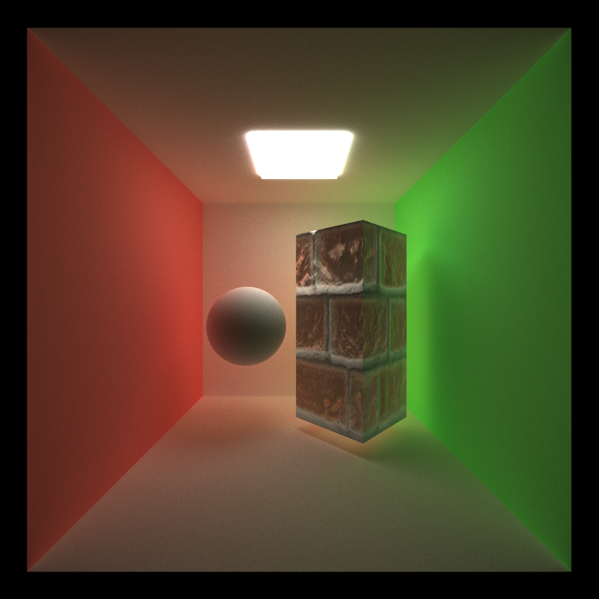

CUDA Path Tracer
================

**University of Pennsylvania, CIS 565: GPU Programming and Architecture, Project 3**

* Yifan Lu
  * [LinkedIn](https://www.linkedin.com/in/yifan-lu-495559231/), [personal website](http://portfolio.samielouse.icu/)
* Tested on: Windows 11, AMD Ryzen 7 5800H 3.20 GHz, Nvidia GeForce RTX 3060 Laptop GPU (Personal Laptop)

## Feature
- Arbitrary Mesh Loading
- Texture Mapping
- Depth of Field
- Environment Mapping
- Post-Process Effect
- Russian Roulette Path Termination
- Refraction
- OIDN Denoise

## Introduction

## Materials
### Reflection

### Refraction

The above image shows the glass ball with IOR 1.5, 2.0, 2.5, 3.0 from left to right, up to down respectively.

This refraction material utilizes both refraction and reflection under Schlick's approximation.

## Environment Map

From left to right, the materials are total reflect, diffuse and refract respectively.

## Arbitrary Mesh Loading and Texture Mapping

## Depth of Field

Depth of field effect shows the physical structure of a camera lens. By toogling lens radius and focal distance, we can get a sharp edge around focal point and adjust the intensity of blur effect.

## Russian Roulette Path Termination
The idea is to terminate ray bouncing early if the ray meets certain standards.

## Post-Process Effect
### Bloom Effect

### Vignette

## OIDN Denoise
The following images shows:
- without denoiser
- with only beauty denoiser
- with beauty + albedo + normal denoiser
  

tested under 1000 samples with denoise interval 10

