CUDA Path Tracer
================

**University of Pennsylvania, CIS 565: GPU Programming and Architecture, Project 3**

* Yifan Lu
  * [LinkedIn](https://www.linkedin.com/in/yifan-lu-495559231/), [personal website](http://portfolio.samielouse.icu/)
* Tested on: Windows 11, AMD Ryzen 7 5800H 3.20 GHz, Nvidia GeForce RTX 3060 Laptop GPU (Personal Laptop)

## Feature
- [Visual Effects](https://github.com/lyifaxxx/Project3-CUDA-Path-Tracer/blob/main/README.md#visual-effects)
  - [Materials](https://github.com/lyifaxxx/Project3-CUDA-Path-Tracer/blob/main/README.md#materials)
    - Diffuse
    - [Specular](https://github.com/lyifaxxx/Project3-CUDA-Path-Tracer/blob/main/README.md#reflection)
    - [Refract](https://github.com/lyifaxxx/Project3-CUDA-Path-Tracer/blob/main/README.md#refraction)
  - [Arbitrary Mesh Loading](https://github.com/lyifaxxx/Project3-CUDA-Path-Tracer/blob/main/README.md#mesh-loading)
  - [Texture Mapping](https://github.com/lyifaxxx/Project3-CUDA-Path-Tracer/blob/main/README.md#texture-mapping)
  - [Depth of Field](https://github.com/lyifaxxx/Project3-CUDA-Path-Tracer/blob/main/README.md#depth-of-field)
  - [Environment Mapping](https://github.com/lyifaxxx/Project3-CUDA-Path-Tracer/blob/main/README.md#environment-map)
  - [Post-Process Effect](https://github.com/lyifaxxx/Project3-CUDA-Path-Tracer/blob/main/README.md#post-process-effect)
    - [Bloom](https://github.com/lyifaxxx/Project3-CUDA-Path-Tracer/blob/main/README.md#bloom-effect)
    - [Vignette](https://github.com/lyifaxxx/Project3-CUDA-Path-Tracer/blob/main/README.md#vignette)
  - [OIDN Denoise](https://github.com/lyifaxxx/Project3-CUDA-Path-Tracer/blob/main/README.md#OIDN-denoise)
- [Optimization](https://github.com/lyifaxxx/Project3-CUDA-Path-Tracer/blob/main/README.md#optimization)
  - [Stream Compaction](https://github.com/lyifaxxx/Project3-CUDA-Path-Tracer/blob/main/README.md#stream-compaction)
    - [Path Termination](https://github.com/lyifaxxx/Project3-CUDA-Path-Tracer/blob/main/README.md#path-termination)
    - [Sort By Material](https://github.com/lyifaxxx/Project3-CUDA-Path-Tracer/blob/main/README.md#sort-by-material)
  - [Russian Roulette Path Termination](https://github.com/lyifaxxx/Project3-CUDA-Path-Tracer/blob/main/README.md#russian-roulette-path-termination)


## Introduction
<p float="center">
  
</p>

A GPU CUDA path tracer with serval visual effects and optimations that utilizes GPU parallelism.
<p float="center">
 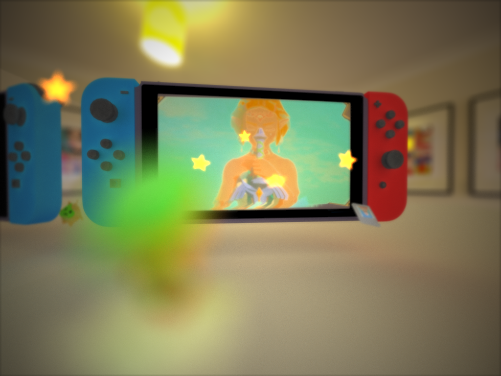
 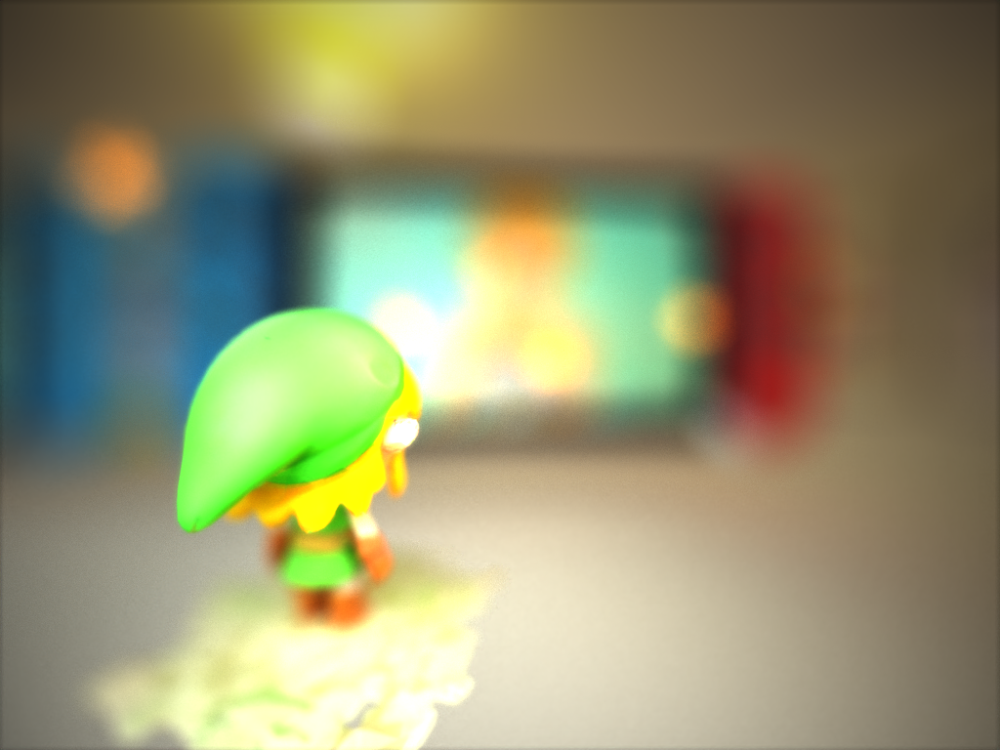
</p>

## Visual Effects
### Materials
#### Overview
Rays are shot from camera and bouncing around in the scene. Material surface properties determine the way rays behave. For every bounce in every ray,  a shading function will be called to compute the throughput at the intersection of the hit surface.

#### Reflection
For reflection surfaces, the angle between normal and outcoming ray is equare to that between incoming ray.

Here is an example of a perfect specular sphere in Cornell box scene:

<p float="center">
  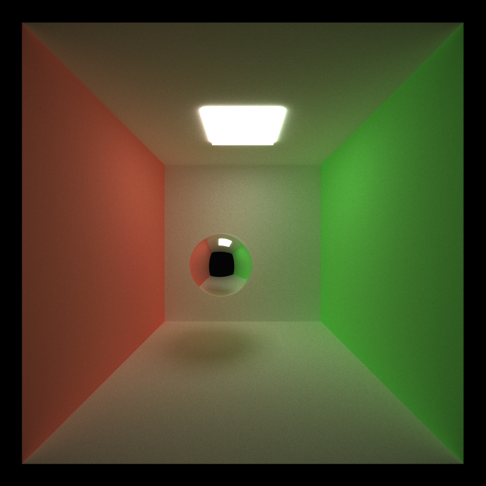
</p>

#### Refraction
When light enters another medium from one medium, such as from air into water, the direction of light ray will change. How the angle change is described as Index Of Refraction. If we take a closer look at a glass ball, you can notice that aside from the entire refraction, there will be a layer of reflection when the glazing angle is very large.

<p float="center">
  
</p>

_The above image shows the glass ball with IOR 1.5, 2.0, 2.5, 3.0 from left to right, up to down respectively._

This refraction material utilizes both refraction and reflection under Schlick's approximation.

#### Performance
Compared to a CPU version, shading the intersections in GPU paralleled threads should be much faster. For complex scenes, the number of intersections will reach a very high level that under the CPU sequential instructions will take up a lot of time. A thrust sort for path segments based on different material types is performed before the shading kernels are called.

However in my implementation, I used one shading kernel for all the materials, which will cause branches inside a warp. To better utilize warp parallelism, we can further optimize the way we call kernel, which is to give seperate kernels for materials and call them accordingly.

### Environment Map
#### Overview
The environment map is used to create realistic reflections and lighting effects from the surrounding environment. If a ray missed an intersection, instead of goes directly to the black void, it samples from a skybox texture via a sphere-uv coordinate.

<p float="center">
  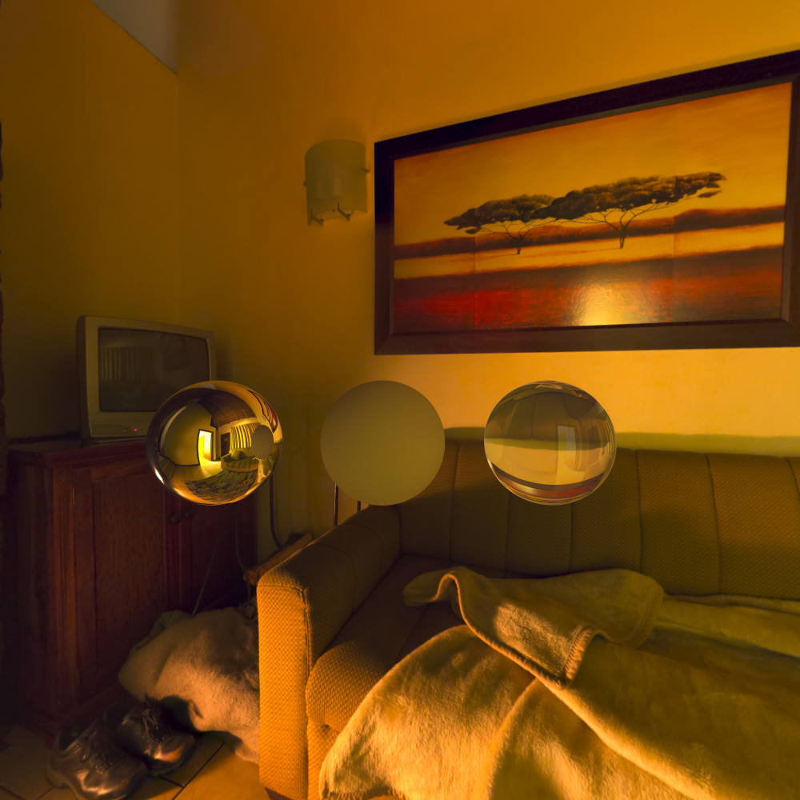
</p>

_From left to right, the materials are total reflect, diffuse and refract respectively._

#### Performance
Before the environment mapping is added to the path tracer, I did a stream compaction to rays that missed a hit after intersection test kernel. However if we want to sample skybox with such rays in the shading kernel, the stream compaction wouldn't be neccessary.

The skybox texture is stored under the whole scene class as a Texture pointer. It will only passed to GPU if the json scene file contains the "skybox" keyword.

### Arbitrary Mesh Loading and Texture Mapping
#### Overview
While it is relatively easy to determine the intersection test for simple geometrys such as spheres and cubes,  support for arbitrary meshes will make our scene more complex.

#### Mesh Loading
I used [tinyObj third-party library](https://github.com/tinyobjloader/tinyobjloader) to handle .obj and .mtl files. The scene structure should also be adjusted to match new mesh property. To name a few, each ```Geom``` has a ```Mesh``` pointer to a potential mesh object and each ```Mesh``` structure contain a pointer to an array of ```Triangle```s. A ```Triangle``` struct has a fixed size that contains the info for 3 vertices.


#### Texture Mapping
This path traser supports albedo/base color texture map and normal map. After the geometries info are parsed by the tinyObj, the texture maps that have info in the .mtl file are stored under the mesh. You can also create a material in the json scene file and assgin it to a given mesh.

<p float="center">
  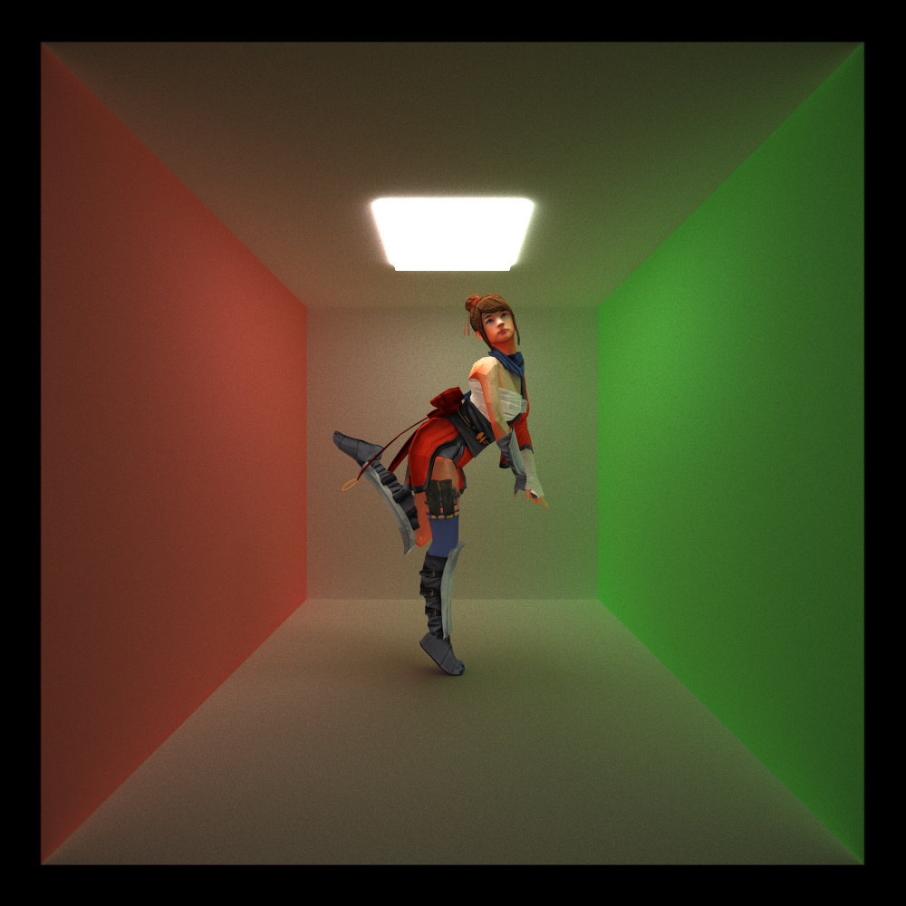
  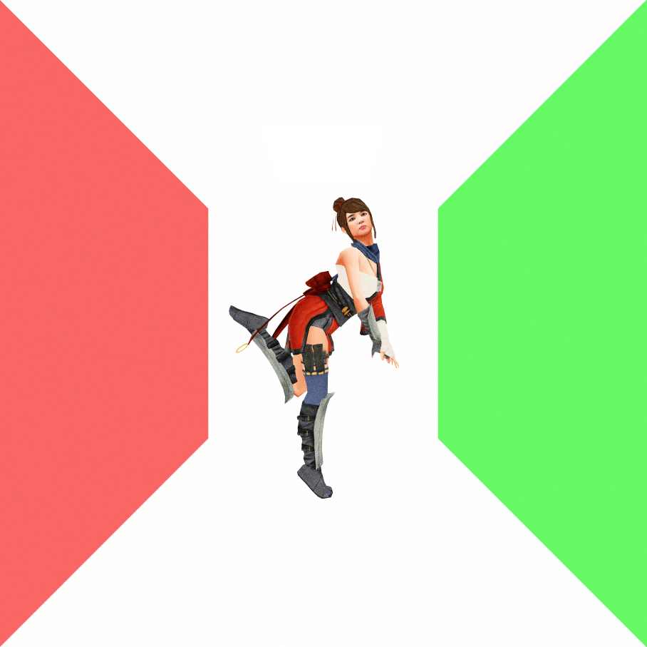
  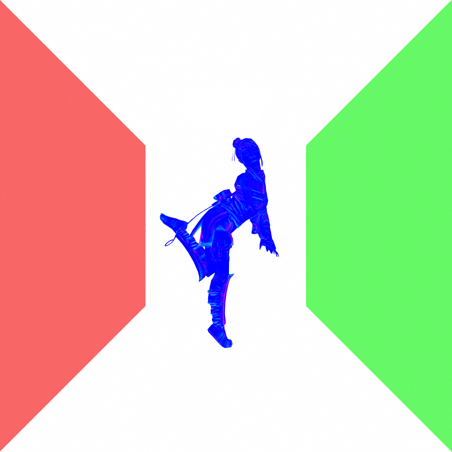
</p>

#### Performance
The bottleneck for texture mapping is memory I/O. Texture maps are usually very large in these days: 2k*2k for 4 channels. When the scene contains serval textured meshes, allocate and free memory for device will require many resources.

In the future, I will add accelerated structures such as BVH to make intersection test faster.


### Depth of Field
<p float="center">
  
</p>

#### Overview
Depth of field effect shows the physical structure of a camera lens. By toogling lens radius and focal distance, we can get a sharp edge around focal point and adjust the intensity of blur effect. More details can be found here.

In my path tracer, I jitter the rays' direction and origin that shoot from camera based on the camera's lens radius and focal distance, as well as their original setting. 

<p float="center">
  
  
  
</p>

#### Performance
On the **performance** side, since doing DoF is on ```generateRayFromCamera``` kernel after randomly jittering ray directions and there is no need to adjust blockSize/blockNum, the computation is relatively free. Doing DoF in GPU would see more benefit than a CPU-version.


### Post-Process Effect
#### Overview
Post process shaders modify final rays to achieve certain visual effects. In this path tracer, I implement two post-process shaders: bloom effect and vignette effect. These shaders are kernels called at the end of iteration, before passing the frame to the screen to render. 

#### Bloom Effect
The bloom effect simulates the bleeding of bright light into surrounding areas, enhancing the perceived brightness of certain parts of the image.

The following pictures shows before the bloom effect(left) and after(right):

<p float="center">
  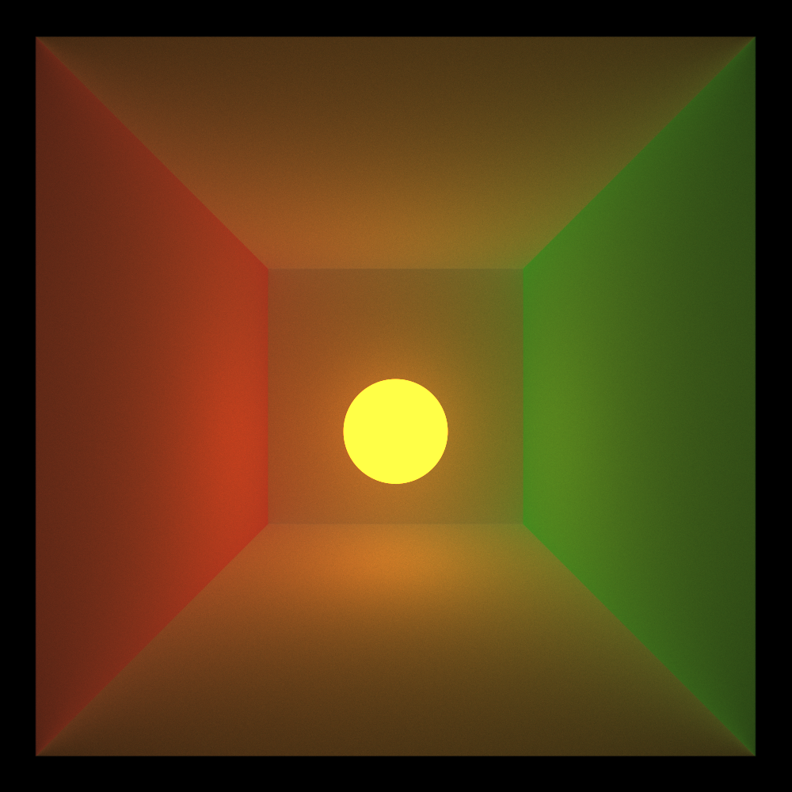
  
</p>


#### Vignette
Vignette adds a darkening effect around the edges of the image, focusing attention toward the center. In the Vignette shader, the kernel checks each path segment if it is around the corner of the frame and add a dark tone to it accordingly.

The following pictures shows the reflect cornell box scene before the Vignette effect(left) and after(right):

<p float="center">
  
  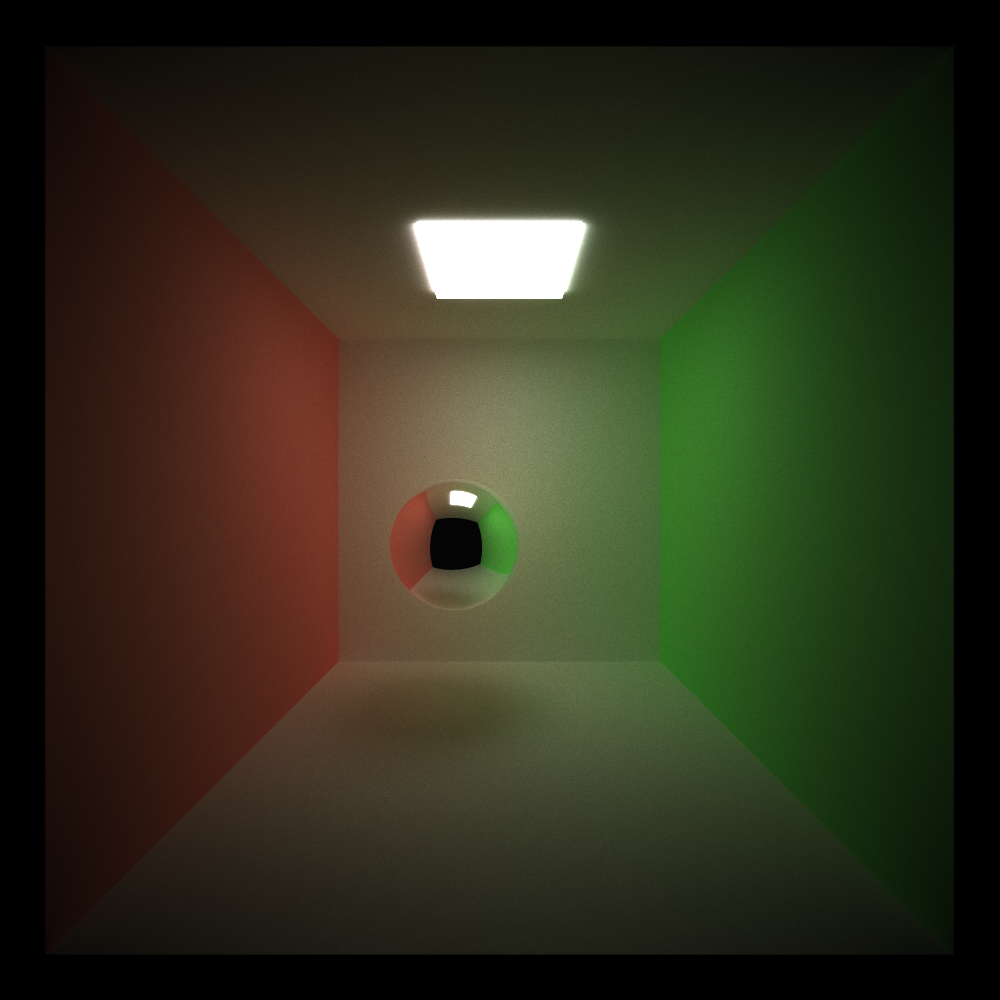
</p>

#### Performance
In theory, the post-process effect will only take place at the final ray of the last iteration. However to see the effect on the rendered window, the post-process shaders work each iteration, which increases unneccessary kernel calls. For post-processes all the pixels on the frame will be evaluated which causes a larger amount of blocks. 

### OIDN Denoise
#### Overview
Intel Open Image Denoise is an open source library of high-performance, high-quality denoising filters for images rendered with ray tracing. See details [here](https://github.com/RenderKit/oidn)

In this path tracer there are 3 buffers fed to the denoiser:
- raw/beauty buffer
- albedo buffer
- normal buffer

Similar to post-process, I also use an addiional buffer to store denoised image and passed to the rendered window at certain intervals.

The following images shows:
- without denoiser
- with only beauty denoiser
- with beauty + albedo + normal denoiser

<p float="center">
  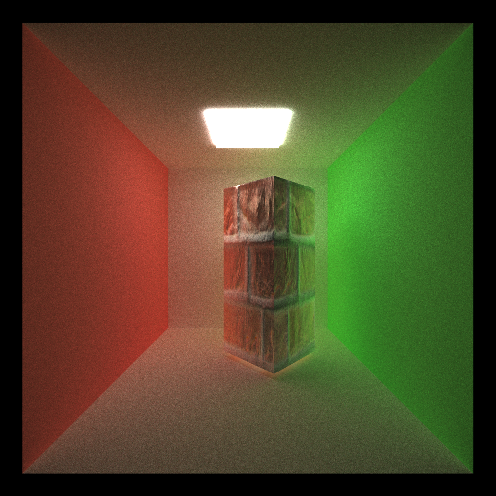
  
  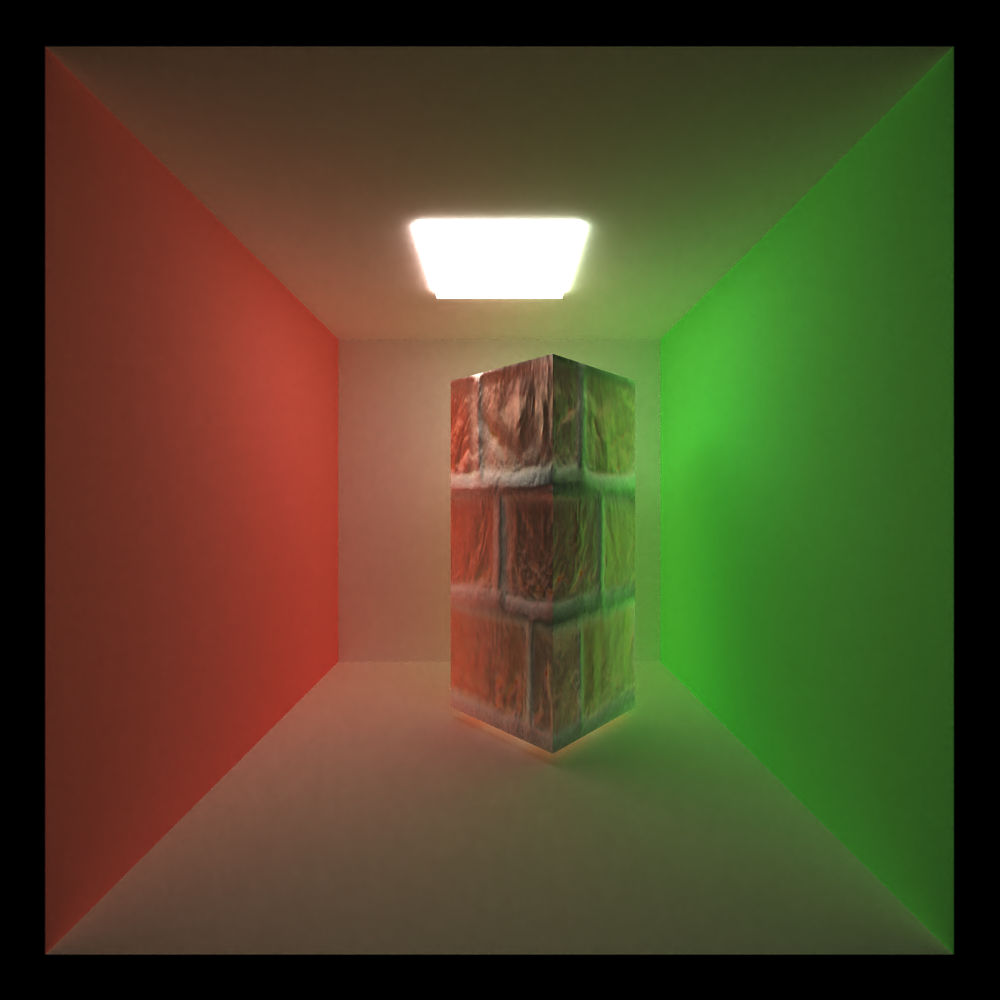
</p>

_tested under 1000 samples with denoise interval 10_

Our Ninja scene from previous sections. With only 100 samples with denoise interval 10, you can see a clear difference:

<p float="center">
  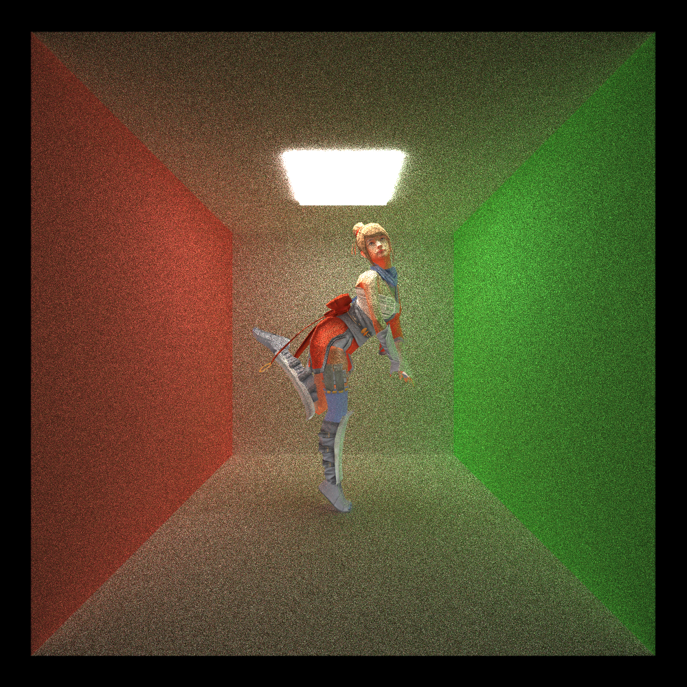
  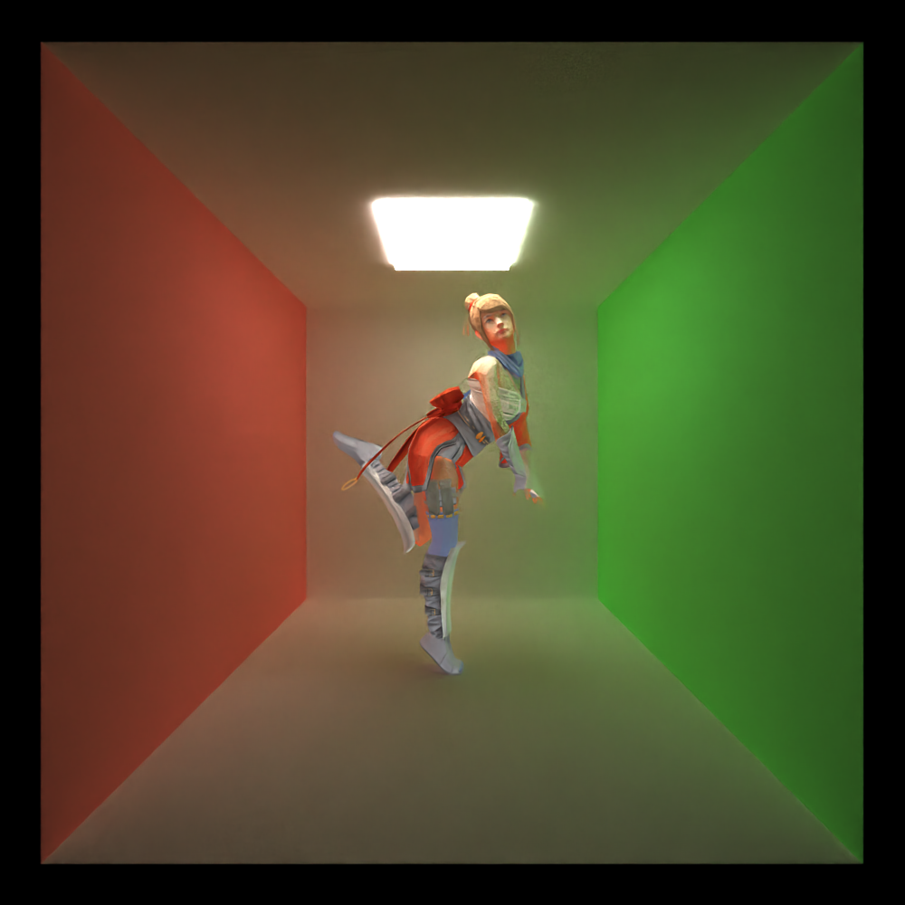
  
</p>

## Optimization
### Stream Compaction
After each bounce, useless path segments will be terminated.

#### Path Termination By Intersection

Check ray's remaining bounce after each depth iteration. To achieve better continuity I also terminate ray after intersection test.

However, if the scene contains an environment map, you can not compact after intersection test since we need the missed-hit ray to sample environment map.

<p float="center">
  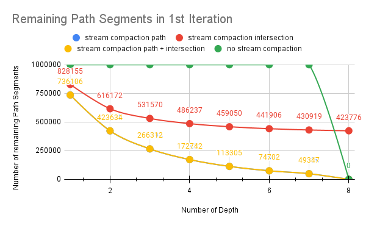
</p>

From the chart we can see that the stream compactions reduce large number of rays and further number of kernels called.


### Sort By Material
Before calling the shading kernel, the path segments are re-arranged by different material types to utilize the parralism of warp.

<p float="center">
  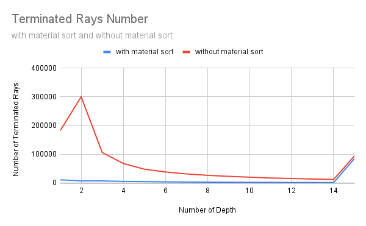
</p>

The above chart may seem a little counter-intuitive. However, the path tracer to generate the chart also uses stream compaction based on intersections. The order of them is : intersection test --> sort by material --> stream compaction based on remaining bounces. 

<p float="center">
  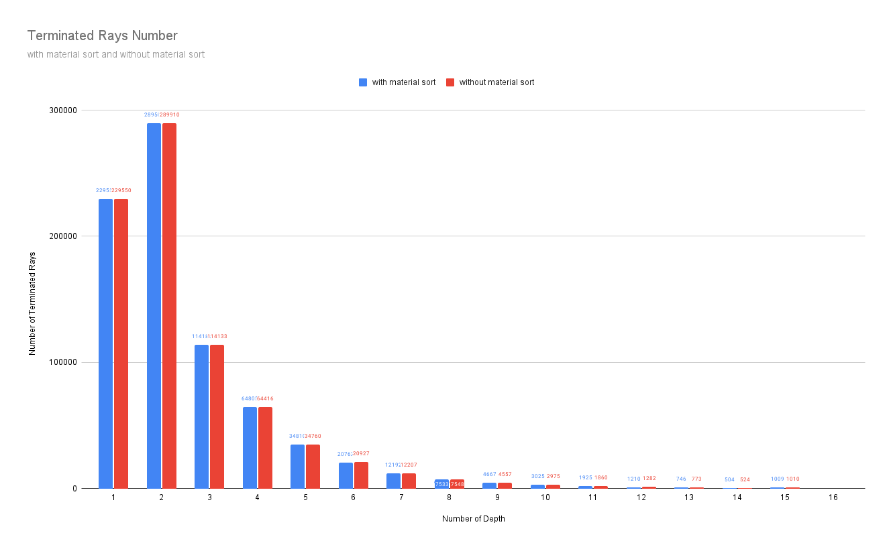
</p>

After we turn off the intersection test compaction, their effect are close with material-sorting a little bit more beneficial. The test scene has 10 different materials, which is not a very large number. In this case, there is no need to sacrifice the frame rate to sort materials.

### Russian Roulette Path Termination
The idea is to terminate ray bouncing early if the ray meets certain standards. The Russian Roulette path termination is performed in the shading kernel after the path segment's color is updated from intersection. The standard is that, if the throughput is larger than a some random uniform number, terminate the ray. It is predicted that for close scenes, it will boost the performance.

<p float="center">
  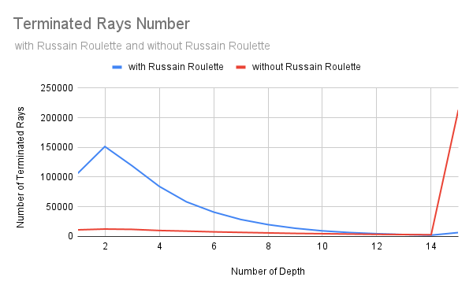
</p>


## References:
[PBRTv4] [Physically Based Rendering: From Theory to Implementation](https://pbr-book.org/4ed/contents)

[Ray Tracing in One Week](https://raytracing.github.io/books/RayTracingInOneWeekend.html)

[Wavefront .obj file](https://en.wikipedia.org/wiki/Wavefront_.obj_file)

Models:

switch model: [https://www.cgtrader.com/free-3d-models/electronics/video/nintendo-switch-3d453081-5360-46b2-b097-e0236d9f4365](https://www.cgtrader.com/free-3d-models/electronics/video/nintendo-switch-3d453081-5360-46b2-b097-e0236d9f4365)

star: [https://free3d.com/3d-model/star-mobile-ready-60-tris-49986.html](https://free3d.com/3d-model/star-mobile-ready-60-tris-49986.html)

Link: [https://sketchfab.com/3d-models/generic-chibi-elf-explorer-meshy-9321872db71d441faa484caf7b5acd39](https://sketchfab.com/3d-models/generic-chibi-elf-explorer-meshy-9321872db71d441faa484caf7b5acd39)

Korok: [https://sketchfab.com/3d-models/korok-904d09ff8e144c39958927b120a1d0dd](https://sketchfab.com/3d-models/korok-904d09ff8e144c39958927b120a1d0dd)

Ninja model and texture courtesy to Deze Lyu.

Courtesy of CIS4610/5610 for texture maps and environment maps.

## Behind the Curtain: How I build a scene (my pipeline for this render)
### Brainstorm an Interesting Scene
I decide to build a scene that contains Nintendo Switch and The legend of Zelda since I am playing Tears of the Kingdom these days.(And also touched by the story between Zelda and Link.)

### Find the Models
For models I searched with keywords in 3D Model sharing websites. Since my path tracer onlt supports .obj file, my search focuses on .obj format files. For models with other formats I converted them in Maya.

### Layout in Maya
With all the main models downloaded, I set a fake scene in maya to find the best layout and angle of camera.

<p float="center">
  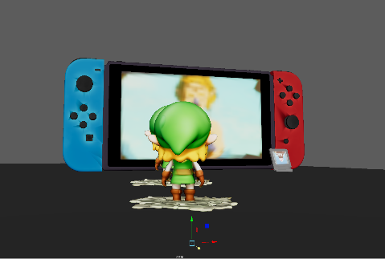
</p>

### Placeholder in Path Tracer
The rendering process is very slow with all the meshes in the scene. To test the position of models as well as other parameters such as DoF and lighting setting.

<p float="center">
  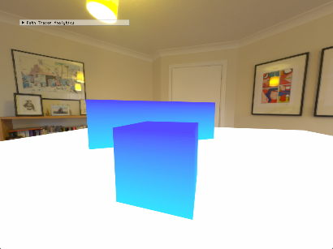
 
</p>

### Final Render
With all the process in my pipeline I can replace the place holders with model and render the scene!
<p float="center">
  
  
 
 
</p>
